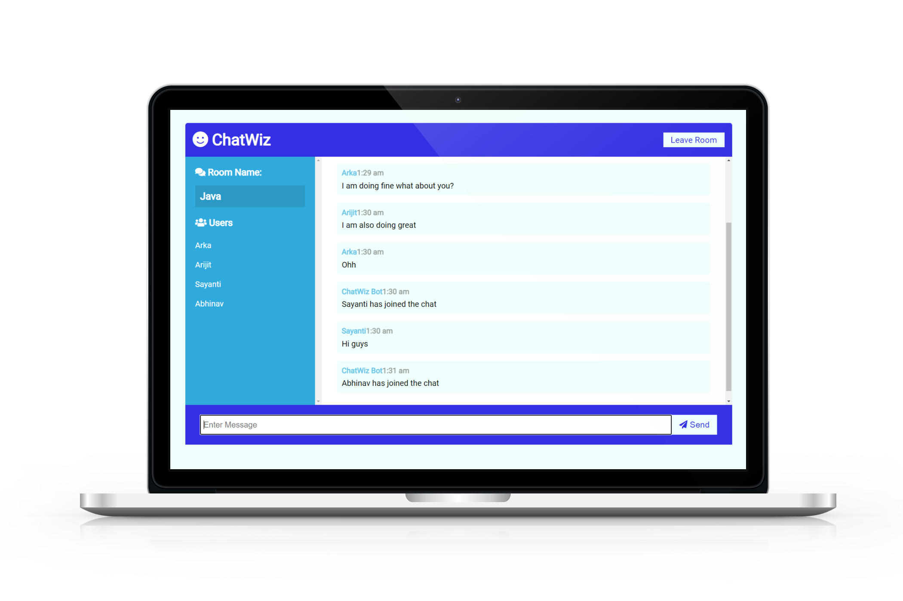

# ChatWiz (Realtime-Chat-Application)

A functional real-time-chat messaging application with rooms for developers by using modern web technologies, i.e. websockets  using Node.js, Express and Socket.io.
## Screenshots




## Run Locally

Clone the project

```bash
  git clone https://github.com/softdevarka/chatwiz-chat-app.git
```

Go to the project directory

```bash
  cd chatwiz-chat-app
```

Run commands

```bash
  npm install
```

Start the server

```bash
  npm run dev
```

Open browser

```bash
  localhost:3000
```

## 🔗 Links
[](https://softdevarka.netlify.app/)
[](https://www.linkedin.com/in/softdevarka/)
[](https://twitter.com/softdevarka)

